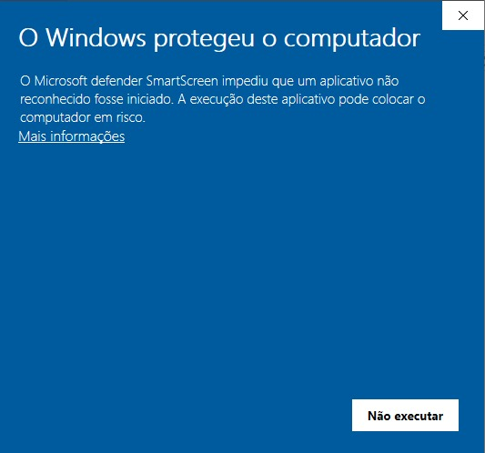

# Easy Tool Kit

 

> **Kit completo de ferramentas** para orquestrar o download, a descriptografia e o processo de indexação de evidências digitais de forma simples.

---

## 📋 Instalação e Configuração

### ⚙️ Pré-requisitos

Antes de começar, certifique-se de ter instalado os seguintes programas:

#### 🔧 **1. Git Bash**

Caso você não tenha o Git instalado na sua máquina, siga as instruções abaixo:

Abra o PowerShell e execute o comando abaixo ou [clique aqui para baixar](https://git-scm.com/install/windows):

```powershell
winget install --id Git.Git -e --source winget
```

#### 🔐 **2. Gpg4win (Kleopatra)**

Você precisará do Gpg4win (Kleopatra) para descriptografar os arquivos `.gpg`.

Caso você não tenha o Gpg4win instalado na sua máquina, clique no link abaixo:

**[📥 Clique aqui para baixar o Gpg4win](https://www.gpg4win.org/download.html)**

#### 🔍 **3. IPED**

Você precisará do IPED para indexação de evidências.

Caso você não tenha o IPED instalado na sua máquina, siga o tutorial da AFD abaixo:

**[📚 Clique aqui e siga o tutorial da AFD para instalar o IPED](https://academiadeforensedigital.com.br/sistema-iped-forense/)**

---

### 🚀 Instalação

#### **1. Download**

**[⬇️ Clique aqui para baixar a versão v0.1.7](https://github.com/izidorio/easy-tool-kit/releases/download/v0.1.7/easy-tool-kit.zip)**

#### **2. Descompactar**

Descompacte o arquivo `.zip` baixado em uma pasta de sua preferência.

#### **3. Executar**

Acesse a pasta descompactada e dê duplo clique no executável `easy-tool-kit.exe`.

> 💡 **Dica:** Para facilitar o acesso, você pode:
> - Clicar com o botão direito sobre o ícone na barra de tarefas e selecionar "Fixar na barra de tarefas"
> - Criar um atalho na sua área de trabalho

> ⚠️ **Aviso:** Este aplicativo não é assinado digitalmente. Na primeira vez que você for executá-lo, o Windows vai gerar um alerta de segurança. Clique em "Mais informações" e depois em "Executar assim mesmo".




#### **4. Configurar**

Clique em **Settings** e selecione os arquivos:
- `git-bash.exe`
- `iped.exe`


---

## 🚀 Como Usar

### **1. ☁️ Criar Nuvem**

Crie uma nova nuvem para organizar suas evidências.


### **2. 🏷️ Nomear Alvo**

Defina um nome descritivo para o alvo da investigação.


### **3. ⬇️ Baixar Nuvem**

Filtre e baixe os arquivos da nuvem selecionada conforme necessário para sua investigação.


### **4. 🔍 Indexar Nuvem com o IPED**

Processe e indexe os arquivos baixados usando o IPED para análise forense.


---

## ⚠️ Isenção de Responsabilidade

Este software é fornecido "como está", sem garantias de qualquer tipo, expressas ou implícitas, incluindo, mas não se limitando a, garantias de comercialização, adequação a um propósito específico e não violação. Em nenhuma circunstância os autores ou detentores dos direitos autorais serão responsáveis por quaisquer reivindicações, danos ou outras responsabilidades, seja em uma ação de contrato, delito ou de outra forma, decorrentes de, fora de ou em conexão com o software ou o uso ou outras negociações no software.

O uso deste software é de sua própria responsabilidade. Os desenvolvedores não se responsabilizam por:
- Perda de dados ou informações
- Danos causados pelo uso inadequado do software
- Problemas de segurança decorrentes do uso do software
- Qualquer consequência legal do uso deste software em investigações forenses

Recomenda-se sempre fazer backup dos dados antes de usar este software e seguir as melhores práticas de segurança digital.

---

## 📄 Licença

MIT License

Copyright (c) 2024 Easy Tool Kit

Permission is hereby granted, free of charge, to any person obtaining a copy
of this software and associated documentation files (the "Software"), to deal
in the Software without restriction, including without limitation the rights
to use, copy, modify, merge, publish, distribute, sublicense, and/or sell
copies of the Software, and to permit persons to whom the Software is
furnished to do so, subject to the following conditions:

The above copyright notice and this permission notice shall be included in all
copies or substantial portions of the Software.

THE SOFTWARE IS PROVIDED "AS IS", WITHOUT WARRANTY OF ANY KIND, EXPRESS OR
IMPLIED, INCLUDING BUT NOT LIMITED TO THE WARRANTIES OF MERCHANTABILITY,
FITNESS FOR A PARTICULAR PURPOSE AND NONINFRINGEMENT. IN NO EVENT SHALL THE
AUTHORS OR COPYRIGHT HOLDERS BE LIABLE FOR ANY CLAIM, DAMAGES OR OTHER
LIABILITY, WHETHER IN AN ACTION OF CONTRACT, TORT OR OTHERWISE, ARISING FROM,
OUT OF OR IN CONNECTION WITH THE SOFTWARE OR THE USE OR OTHER DEALINGS IN THE
SOFTWARE.
