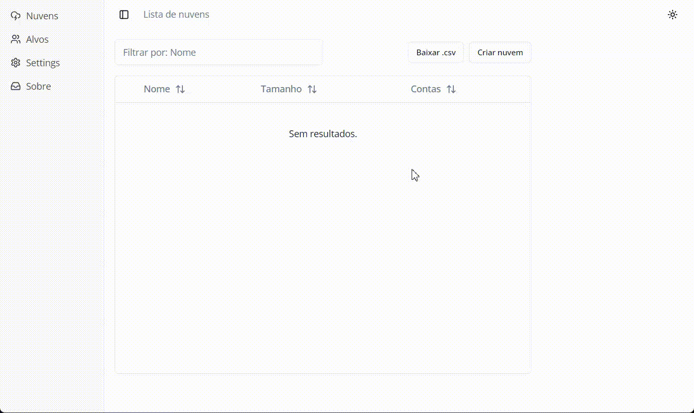
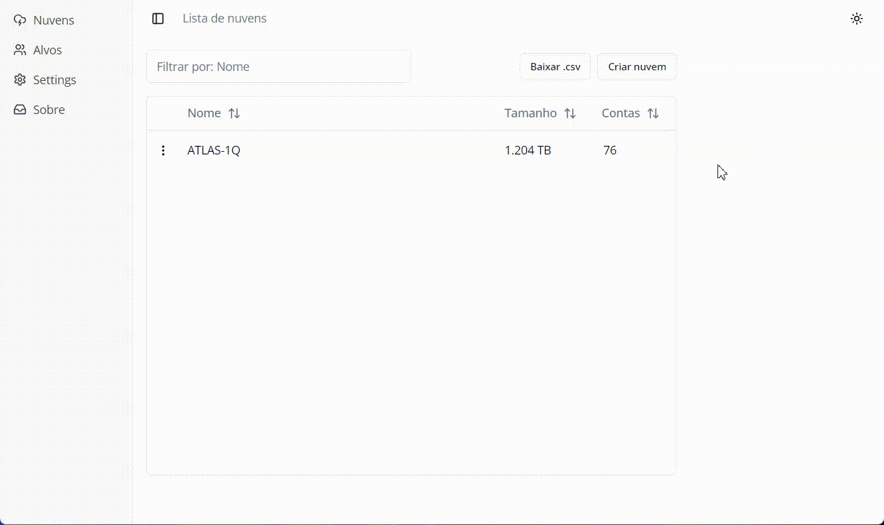
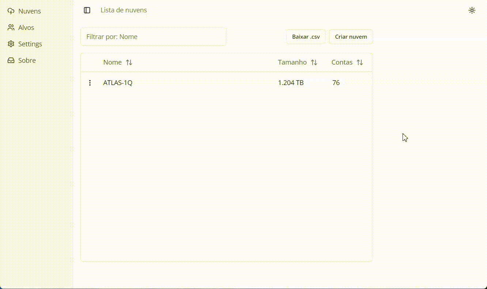

# Easy Tool Kit

 

> **Kit completo de ferramentas** para orquestrar o download, a descriptografia e o processo de indexação de evidências digitais de forma simples.

---

## 📋 Instalação e Configuração

### ⚙️ Pré-requisitos

Antes de começar, certifique-se de ter instalado os seguintes programas:

#### 🔧 **1. Git Bash**

Caso você não tenha o Git instalado na sua máquina, siga as instruções:

Abra o PowerShell e execute o comando abaixo ou use o [link clicando aqui para baixar](https://git-scm.com/install/windows) : 

```powershell
winget install --id Git.Git -e --source winget
```

#### 🔐 **2. Gpg4win (Kleopatra)**

Você vai precisar do Gpg4win (Kleopatra) para descriptografar os arquivos `.gpg`.

Caso você não tenha o Gpg4win instalado na sua máquina, clique no link abaixo:

**[📥 Clique aqui para baixar o Gpg4win](https://www.gpg4win.org/download.html)**

#### 🔍 **3. IPED**

Você vai precisar do IPED para indexação de evidências.

Caso você não tenha o IPED instalado na sua máquina, siga o tutorial da AFD abaixo:

**[📚 Clique aqui e siga o tutorial da AFD para instalar o IPED](https://academiadeforensedigital.com.br/sistema-iped-forense/)**

---

### 🚀 Instalação

#### **1. Download**

**[⬇️ Clique aqui para baixar a versão v0.1.7](https://github.com/izidorio/easy-tool-kit/releases/download/v0.1.7/easy-tool-kit.zip)**

#### **2. Descompactar**

Descompacte o arquivo `.zip` baixado em uma pasta de sua preferência.

#### **3. Executar**

Acesse a pasta e dê duplo clique no executável `easy-tool-kit.exe`.

> 💡 **Dica:** Para facilitar o acesso, você pode:
> - Clicar com o botão direito sobre o ícone na barra de tarefas e selecionar "Fixar na barra de tarefas"
> - Criar um atalho na sua área de trabalho

#### **4. Configurar**

Clique em **Settings** e selecione os arquivos:
- `git-bash.exe`
- `iped.exe`




---

## 🚀 Como Usar

### **5. ☁️ Criar Nuvem**

Crie uma nova nuvem para organizar suas evidências.


### **6. 🏷️ Nomear Alvo**

Defina um nome descritivo para o alvo da investigação.



### **7. ⬇️ Baixar Nuvem**

Filtre e baixe os arquivos da nuvem selecionada conforme necessário.


### **8. 🔍 Indexar Nuvem com o IPED**

Processe e indexe os arquivos baixados usando o IPED para análise forense.


